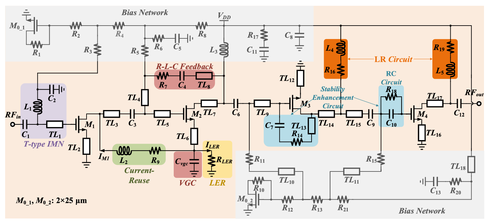
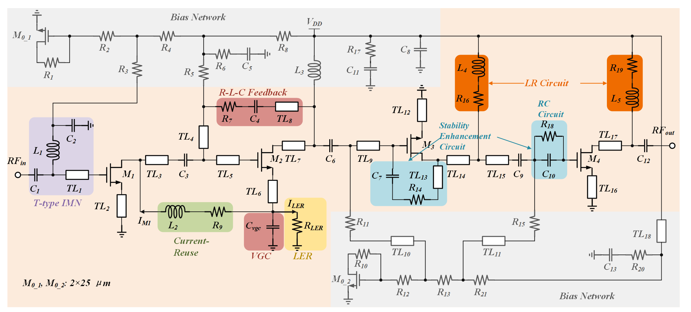

# Visio Drawing

把参考图片重绘为 **原生、可编辑的 Microsoft Visio 图纸** 的 Codex Skill，适用于电路原理图、框图、流程图和由标准模块组成的科学示意图。

元件、文字、连线和功能色块均为独立对象。电气连线连接到具名引脚；生成后检查保存文件中的连接记录，并逐区域对照参考图。

## 效果示例：四级 RF LNA 电路图

下面展示一次实际重绘任务。图中包含偏置网络、T 型输入匹配、电流复用、R-L-C 反馈、稳定性增强以及 LR、RC 支路。

### 参考图片



### Visio 重绘结果



[下载可编辑 VSDX](examples/rf-lna/output/RF_LNA.vsdx) · [PDF](examples/rf-lna/output/RF_LNA.pdf) · [SVG](examples/rf-lna/output/RF_LNA.svg) · [PNG](examples/rf-lna/output/RF_LNA.png) · [验证报告](examples/rf-lna/output/RF_LNA.verification.json)

这份示例包含 **79 个元件、49 组电气网络**，并保留原图的上下标、功能配色和电流方向标注。关键细节包括：

- C₂、C₅、C₁₃ 末端的短线是横向接地符号。
- M₃ 的源极位于上方，经 TL₁₂ 接地；C₇—R₁₄—TL₁₃ 构成栅极至漏极的串联支路。
- R₇ 接在 TL₄ 上方，电流复用的 R₉ 接在 TL₆ 下方。
- 两条 LR 支路分别接入 TL₁₄/TL₁₅ 与 TL₁₇/C₁₂ 的连接点。

这些关系来自**这张参考图的逐区检查**，不能套用到其他电路。元件原生符号与参考图存在少量风格差异；输出端交叉线使用无连接点的交叉约定，代替原图的小跨线弧。

[查看完整示例、证据和复现步骤 →](examples/rf-lna/README.md)

## 能做什么

| 类型 | 支持内容 |
| --- | --- |
| 电路元件 | R/L/C、三端与四端 MOS、BJT、接地、焊盘、矩形传输线、电流源、电压源 |
| 模块与流程 | 矩形、菱形、椭圆、数据平行四边形、背景容器、具名端口与方向箭头 |
| 标注 | 可编辑文字、多处上下标、颜色、功能分区、圆角色块和说明箭头 |
| 导出 | VSDX、PNG、SVG、PDF，以及 JSON 验证报告 |
| 检查 | 源图转录一致性、元件清单、网络连通性、保存后的引脚吸附、部分布局冲突、区域视觉复核 |

这是一套由智能体读取图片、建立模型并调用脚本完成绘制的工作流。路由器负责简单正交走线，不会自动避开所有障碍；它不执行电路仿真、PCB 设计或任意图片的一键无损转换。

## 运行环境

- Windows，已安装桌面版 Microsoft Visio（需要 COM 自动化）。
- PowerShell 7，命令名 `pwsh`。
- Python 3.10 或以上，以及 Pillow。
- 支持加载本地 Skill、读取图片和执行本地脚本的 Codex 环境。

```powershell
python -m pip install -r requirements.txt
```

若 `python` 指向 Windows Store 占位程序，请使用实际的 `python.exe` 路径。该项目不包含 Microsoft Visio，也不要求填写模型 API 密钥。

## 安装与使用

将本仓库作为 `visio-drawing` 文件夹放入 Codex 的个人技能目录。以下命令适用于默认目录；已有同名文件夹时，请先保留已有版本再安装。

```powershell
git clone https://github.com/Sukai777/visio-drawing.git "$env:USERPROFILE/.codex/skills/visio-drawing"
```

如果设置了自定义 `CODEX_HOME`，请放入其 `skills/visio-drawing` 子目录。随后在能够发现该技能的 Codex 任务中附上参考图片，并提出绘制要求，例如：

```text
使用 $visio-drawing 重绘这张电路图。
请保留原图元件编号、上下标、功能配色和电路连接关系，
输出可编辑 VSDX、PNG、SVG、PDF，并逐区检查元件及连线。
```

也可以要求优化间距、修改颜色或调整布局；明确要求尽量逐像素还原时，技能会优先遵循该要求。

## 工作流程

1. **读图并记录证据**：按区域列出元件、边界、文本、连接点以及必须连接和必须分离的端点。
2. **锁定源图转录**：保存源图与证据哈希，防止为了让检查通过而改写预期连接。
3. **建立绘图模型**：使用区域局部坐标、原生元件、具名引脚和正交连线。
4. **绘制与导出**：由 Visio 保存图纸，并导出 PNG、SVG、PDF。
5. **验证与视觉复核**：检查保存的 VSDX 包及引脚连接，查看每个区域的原图对照，再完成复核记录。

网络检查证明的是图纸与已锁定转录的一致性；读图解释仍须视觉检查，不能把检查通过当成自动理解原图的数学证明。

## 仓库结构

```text
visio-drawing/
├── SKILL.md                  技能入口
├── agents/                   技能显示信息
├── assets/                   自绘 Visio 元件库、具名引脚及尺寸信息
├── scripts/                  编译、原生绘制、导出及验证脚本
├── references/               模型格式、电路判读与视觉复核说明
├── examples/
│   ├── rf-lna/               README 中的完整电路图案例
│   ├── sources/              其他示例的参考图片
│   └── *.json                小信号、LR 局部支路、流程图示例
├── requirements.txt
└── LICENSE
```

模型与证据格式见 [model-and-evidence.md](references/model-and-evidence.md)，验证范围见 [validation.md](references/validation.md)。

## 许可

项目代码、文档及作者提供的自绘元件库采用 [MIT License](LICENSE)。元件来源及分享授权记录保留在 [ASSET-AUTHORIZATION.md](ASSET-AUTHORIZATION.md)。

示例中的参考图片由使用者提供，用于说明重绘过程；MIT 许可证不改变第三方原始图片或其中技术内容已有的权利归属。
